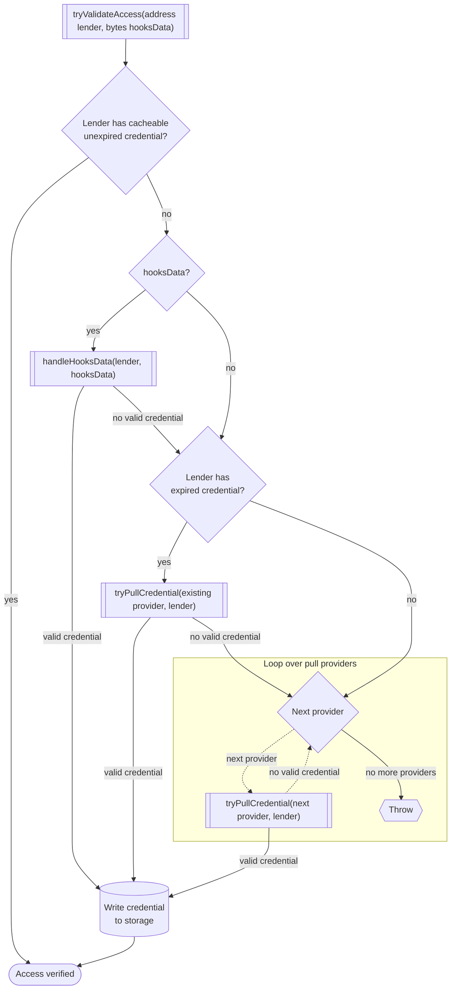
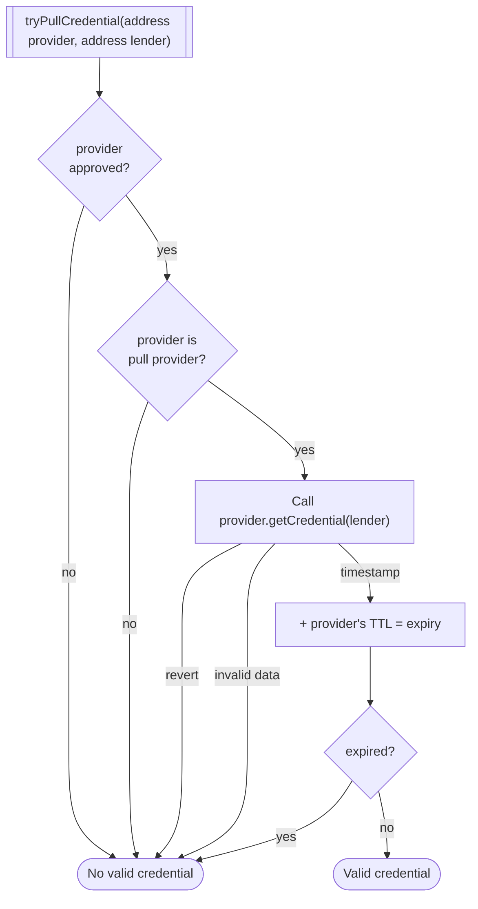
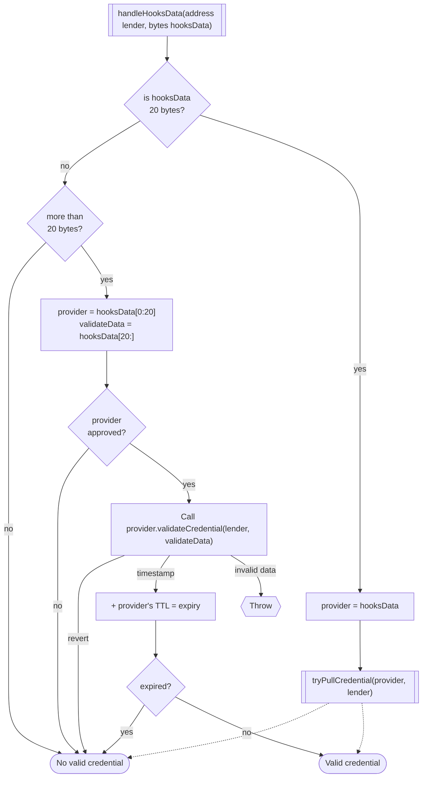

# Access control hooks

The hook administrator configures a set of role providers that issue or validate lender credentials. The hook decides which providers it trusts and which market actions require access. It does not own the provider's credential list.

Hook administration does not confer credential authority. A new hook does not add its administrator as a provider automatically. The administrator may attach an existing provider or create one through a compatible provider factory.

The hook administrator configures each provider with a TTL, which controls how long the hook may use a credential without consulting the provider again.

## Hook administration

Factory-created access-control hooks expose `administrator()` and `pendingAdministrator()`. The current administrator may request a transfer to another ArchController-registered principal, replace a pending request, or cancel it. The target must still be registered when it accepts.

The pending administrator has no authority before acceptance. Only the pending address may accept. Acceptance changes the hook administrator and updates the creating factory's administrator index in the same transaction; if the factory callback fails, the entire acceptance reverts. The factory records the result but cannot initiate the transfer or reassign the hook on its own.

Hook transfer changes who may configure provider attachments, TTLs, hook-local blocks, and hooked-market policy. It does not transfer a market, rewrite lender status, change provider membership or administration, or move the hook merely because one of its markets changes borrowers. The compatibility getter `borrower()` returns the current hook administrator.

A role provider can be a push provider, a pull provider, or a validation provider depending on what it supports.
All approved role providers can push credentials by calling `grantRole` or `grantRoles`.
A provider is treated as a pull provider only if it successfully implements `isPullProvider()` and returns true, meaning the hooks contract can query it with `getCredential` to check if a lender has a credential using only the lender's address.
Providers that do not implement `isPullProvider()` are treated as push-only providers and are not included in automatic pull loops; if explicitly selected through `hooksData`, the hooks contract may still call `validateCredential()`.

## Role providers

Role providers can "push" credentials to the hooks contract by calling:
- `grantRole(address account, uint32 roleGrantedTimestamp) external`
- `grantRoles(address[] accounts, uint32[] roleGrantedTimestamps) external`

The pushed `roleGrantedTimestamp` must be nonzero and no later than the current block timestamp.
Historical timestamps are allowed so providers can preload credentials that were granted earlier.

There are three functions that the hooks contract can call on role providers that implement them:
- `isPullProvider() external view returns (bool)`
  - Defines whether the hooks contract can retrieve credentials using `getCredential`.
- `getCredential(address account) external view returns (uint32 timestamp)`
  - Looks up a credential for an account using only its address, so it must already be stored somewhere.
- `validateCredential(address account, bytes calldata data) external returns (uint32 timestamp)`
  - Attempts to validate a credential from some arbitrary data (e.g. ecdsa signature or merkle proof).

Role providers do not *have* to implement any of these functions to be approved as push providers.
For example, a role provider can be an EOA, multisig, or smart account that only pushes credentials.
Pull providers must implement `isPullProvider()` and `getCredential()`.
Providers used with `hooksData` validation must implement `validateCredential()`.

Role-provider administration is optional and separate from hook administration. `IRoleProvider` does not define an owner. A third-party, immutable, or ownerless provider remains valid if the hook administrator chooses to trust it.

## Singleton lender hooks

The singleton hook templates use a different shape from a reusable lender list. Each instance
constructs one immutable `SingletonRoleProvider`, confirms its deterministic factory binding, and
seals provider configuration. The market then has one direct lender credential route for its life.

There are open, fixed, and periodic singleton variants. They share the admission rule and canonical
wrapper transfer exception; their parent templates retain their respective market lifecycle rules.
See [Singleton Lender Hooks](./Singleton%20Lender%20Hooks.md) for the three variants and their
boundaries.

## Access-list role provider

`AccessListRoleProvider` is the managed pull provider included with v2.5. One instance is one reusable address list, and the same instance can be attached to several hooks. Use separate instances when two sets of hooks should not share a list.

The current provider administrator may add or remove one member or an explicitly supplied batch. Members are enumerable, but removal uses swap-and-pop, so enumeration order is not stable. Each membership event records the provider's current administrator. The factory deployment event separately records the actual factory caller and the full initial member list. The provider has no hook callbacks, market authority, token functions, or list of attached hooks.

Provider administration uses its own two-step transfer. The pending administrator has no authority before acceptance. Acceptance changes only the provider administrator; the provider address, membership, and every hook attachment stay unchanged. There is no ArchController or Foundation registration check for providers or their administrators.

`AccessListRoleProviderFactory` can deploy a provider directly or through the hook's generic `createRoleProvider` helper. Generic factory calldata is `abi.encode(AccessListRoleProviderFactoryInputs)`, where the struct contains `administrator`, `initialMembers`, and `salt`. The intended administrator is explicit because the factory caller may be a hook rather than the provider administrator. CREATE2 salts are namespaced by the caller, and the factory keeps no authority over the provider after deployment.

The provider returns the current block timestamp for a listed account and zero for an unlisted account. It does not store a credential timestamp because membership remains valid until the administrator removes it.

### TTL and removal behavior

TTL `0` on a pull provider means no cache. The hook queries the provider on every credential-gated interaction, including another interaction in the same block. Removing an access-list member therefore affects the next gated check immediately.

A positive TTL is an explicit cache window. If a hook queried the provider at timestamp `T`, the cached credential remains valid through `T + TTL`; membership removal takes effect for that hook after the cached credential expires. Different hooks may have different cache windows for the same provider.

Push providers keep the existing timestamp behavior. A push credential with TTL `0` is usable at its grant timestamp but cannot be refreshed by the hook.

## Merkle role provider

`MerkleRoleProvider` keeps one reusable allowlist root. It is a validation provider, so a lender supplies a proof with each fresh credential check. The hook data is `abi.encodePacked(provider, abi.encode(proof))`, where `proof` is a `bytes32[]`. Leaves are `keccak256(abi.encode(account))`, and each pair is sorted before hashing.

The administrator can replace the root and can move that authority through the same two-step administration interface used by the access-list provider. The provider address and hook attachments do not change. A root update takes effect according to the TTL configured by each hook. TTL `0` requires a fresh proof after the block timestamp advances, but a credential granted at the current timestamp remains usable for the rest of that timestamp. A positive TTL keeps an existing credential valid until its cache window expires.

The provider does not store or enumerate the underlying list. The borrower is responsible for keeping the canonical list and generating proofs. `MerkleRoleProviderFactory` can create a provider directly or through the hook's generic `createRoleProvider` helper. The factory assigns an explicit intended administrator, emits the initial root and deployment context, and keeps no authority after deployment.

## ERC20 role provider

`ERC20RoleProvider` is an immutable pull provider. It grants a credential when `token.balanceOf(account)` is greater than or equal to its configured `minBalance`. The threshold is inclusive, uses the token's base units, and checks only the balance reported for that account.

The hook administrator chooses which token to trust. A malicious or nonconforming token can lie or revert, and a rebasing token can change eligibility without a transfer. The provider does not prove holding time or prevent a temporary or borrowed balance from satisfying the threshold during a check.

TTL `0` follows the live token balance on every gated interaction. A positive TTL keeps the last successful credential until its cache window expires, even if the account transfers the tokens first. If `balanceOf` reverts, the hook treats that as no credential and continues checking other configured providers.

`ERC20RoleProviderFactory` creates a provider directly or through the hook constructor. Its CREATE2 salt is scoped to the factory caller, its deployment event contains the complete immutable configuration, and neither the factory nor the provider has an administrator.

A Wildcat market token for one market may authorize another market. It cannot authorize its own market during a state-changing call because the market's guarded `balanceOf` rejects the nested read while that market is already executing.

## ERC721 role provider

`ERC721RoleProvider` is an immutable pull provider. It grants a credential when `token.balanceOf(account)` is greater than zero, so any token ID in the configured collection qualifies. The hook administrator chooses which collection to trust. A malicious or nonconforming collection can lie or revert, and the provider does not prove how long the account held a token.

TTL `0` follows live collection balances on every gated interaction. A positive TTL keeps the last successful credential until its cache window expires, even if the account transfers its last token first. If `balanceOf` reverts, the hook treats that as no credential and continues checking other configured providers.

`ERC721RoleProviderFactory` creates a provider directly or through the hook constructor. Its CREATE2 salt is scoped to the factory caller, its deployment event contains the collection and interface-check setting, and neither the factory nor the provider has an administrator. When interface checking is enabled, the constructor requires valid ERC165 and ERC721 support. The explicit bypass supports balance-compatible collections that do not advertise ERC165; it does not repair an incompatible collection.

## ERC1155 role provider

`ERC1155RoleProvider` is an immutable pull provider. It grants a credential when `token.balanceOf(account, tokenId)` is greater than zero. Only the configured token ID counts. The hook administrator chooses which collection to trust, and the provider does not prove holding time or prevent a temporary balance from satisfying the check.

TTL `0` follows the live balance of the configured token ID on every gated interaction. A positive TTL keeps the last successful credential until its cache window expires, even if the account transfers or burns the balance first. If `balanceOf` reverts, the hook treats that as no credential and continues checking other configured providers.

`ERC1155RoleProviderFactory` creates a provider directly or through the hook constructor. Its CREATE2 salt is scoped to the factory caller, its deployment event contains the collection, token ID, and interface-check setting, and neither the factory nor the provider has an administrator. The interface-check bypass has the same narrow compatibility purpose as the ERC721 provider.

## ERC-4626 assets role provider

`ERC4626AssetsRoleProvider` is an immutable pull provider. It grants a credential when `vault.convertToAssets(vault.balanceOf(account))` is greater than or equal to its configured `minAssets`. The threshold uses the underlying asset's base units and checks only shares held directly by the account.

This is an ideal asset conversion, not a guarantee that the account can redeem that amount immediately. Vault fees, limits, liquidity, or malicious behavior can make actual redemption different. The provider also does not prove holding time or prevent borrowed shares from satisfying the threshold during a check. The hook administrator chooses which vault to trust.

TTL `0` follows the live share balance on every gated interaction. A positive TTL keeps the last successful credential until its cache window expires, even if the account transfers or redeems the shares first. If the vault reverts, the provider call reverts. The hook treats that as no credential and continues checking other configured providers.

`ERC4626AssetsRoleProviderFactory` creates a provider directly or through the hook constructor. Its CREATE2 salt is scoped to the factory caller, its deployment event contains the complete immutable configuration, and neither the factory nor the provider has an administrator.

A Wildcat wrapper for one market may authorize another market. It cannot authorize its own wrapped market during a state-changing call because wrapper conversion reads that market's guarded `scaleFactor()` while the market is already executing.

## tryValidateAccess(address lender, bytes hooksData)

When a restricted function is called, the access control contract will attempt to validate the caller's access to the market in several ways.

1. If the lender has a cacheable, unexpired credential from a provider that is still supported, return true. A pull credential with TTL `0` is never cacheable.
2. If the lender provided `hooksData`, run [`handleHooksData(lender, hooksData)`](#handleHooksDataaddress-lender-bytes-hooksData)
    - If it returns a valid credential, go to step 5
3. If the lender has an expired credential from a pull provider that is still supported, try to refresh their credential with `getCredential` (see: [tryPullCredential](#tryPullCredentialaddress-provider-address-lender))
   - If it returns a valid credential, go to step 5
4. Loop over every pull provider in `pullProviders`, excluding any existing provider or `hooksData` provider already checked
    - Run [tryPullCredential](#tryPullCredentialaddress-provider-address-lender) on each provider.
    - If any returns a valid credential, break the loop and go to step 5
5. If any provider yielded a valid credential, update the lender's status in storage with the new credential and return.
6. Otherwise, throw an error.

## tryPullCredential(address provider, address lender)

1. If the provider is not approved, return with no valid credential
2. Call `getCredential` on the provider
     - If it reverts, return with no valid credential
3. Add the returned `timestamp` to the provider's TTL to get the expiry
4. If the resulting credential is expired, return with no valid credential
5. Return with valid credential

## handleHooksData(address lender, bytes hooksData)

1. Is `hooksData` 20 bytes?
    - If not, go to 2
    - Set `provider` to `hooksData`
    - Return result of `tryPullCredential(provider, lender)`
2. Is `hooksData` more than 20 bytes?
     - If not, return false
3. Take first 20 bytes as `provider`, the rest is `validateData`
4. If the provider is not approved, return false
5. Call `validateCredential(lender, validateData)`
    - If it reverts, return false
    - If it returns invalid data, throw an error because the call could have side effects
6. Add the returned timestamp to the provider's TTL to calculate the expiry
7. If it is expired, return false
8. Return true

If `hooksData` selects a pull provider and does not yield a valid credential, that provider is skipped during the later automatic pull-provider loop in `tryValidateAccess`.
  

