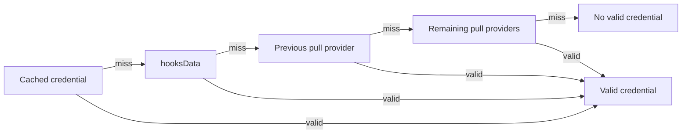

# Access Control

[`BaseAccessControls`](../../src/access/BaseAccessControls.sol) provides the
credential system shared by `OpenTermHooks`, `FixedTermHooks`, and
`PeriodicTermHooks`. One hooks instance may serve several markets. Provider
configuration and lender credentials belong to the hooks instance; action
requirements and known-lender status belong to each market.

See [hooks](./hooks.md) for the callback system and
[role providers](./role-providers.md) for the supported provider contracts.

## Authority boundaries

- The hooks administrator manages the instance name, provider attachments,
  provider TTLs, deposit blocks, and template-specific market settings.
- A role provider owns or validates its credentials under its own rules.
  Attaching a provider does not transfer its administration to the hook.
- A market borrower operates that market. Changing the market borrower does not
  change the hooks administrator or provider configuration.
- The creating hooks factory deploys and indexes instances. It cannot initiate
  an administrator transfer or reassign an instance.

Hook administration does not confer credential authority. The administrator is
not automatically a provider.

## Hook administration

The current administrator may call `requestAdministratorTransfer`, replace a
pending request, or cancel it with `cancelAdministratorTransfer`. The target
must be nonzero, different from the current administrator, and registered with
the ArchController when requested.

The pending administrator has no authority before calling
`acceptAdministratorTransfer`. Registration is checked again on acceptance.
Acceptance changes the administrator, clears the pending address, and calls the
creating factory's `onHooksAdministratorTransferred` callback in the same
transaction. A callback failure reverts the entire transfer.

The transfer changes who may configure the hooks instance. It does not transfer
markets, alter lender status, change provider membership or administration, or
follow a later market-borrower transfer. The compatibility getter `borrower()`
returns the current hooks administrator.

## Provider configuration

The administrator may attach an existing provider with `addRoleProvider`,
remove one with `removeRoleProvider`, or deploy and attach one through a
compatible factory with `createRoleProvider`.

On first attachment, the hook classifies the provider using a `staticcall` to
`isPullProvider()`. Only a successful call returning a complete word equal to
`true` creates a pull provider. A revert, short response, `false`, or malformed
boolean creates a non-pull provider. Updating an attached provider changes only
its TTL; classification is not probed again.

Pull providers participate in automatic `getCredential` checks. Non-pull
providers do not. Every approved provider may push credentials with
`grantRole` or `grantRoles`, and any approved provider may be selected for an
explicit `validateCredential` call through `hooksData`.

Provider removal uses swap-and-pop. Array order and provider indices are not
stable. Removing a provider does not immediately rewrite lender records, but
credentials from that provider are unsupported on the next validation.

## Credential state and expiry

Each hooks instance stores one `LenderStatus` per account:

```solidity
struct LenderStatus {
  bool isBlockedFromDeposits;
  address lastProvider;
  bool canRefresh;
  uint32 lastApprovalTimestamp;
}
```

Only the most recent credential is stored. Its expiry uses the provider's
current TTL:

```text
expiry = min(lastApprovalTimestamp + timeToLive, type(uint32).max)
valid  = lastApprovalTimestamp != 0 && expiry >= block.timestamp
```

- Changing a provider's TTL immediately changes the effective expiry of every
  credential previously issued by that provider.
- A zero-TTL pull credential is never accepted from cache. The provider is
  queried on every gated interaction, including another interaction at the same
  block timestamp.
- A pushed credential with zero TTL is usable only at its grant timestamp. It
  cannot refresh automatically, although an explicit validation may replace it.
- Positive TTLs allow cached credentials through the inclusive expiry. Expiry
  arithmetic saturates at `type(uint32).max`.

### Grants, revocation, and deposit blocks

An approved provider may grant a credential with a nonzero timestamp no later
than `block.timestamp`. The resulting credential must still be valid. A grant
may replace an existing credential only when the caller is the recorded
provider, the recorded provider is no longer approved, or the new expiry is
strictly later.

Only the address recorded in `lastProvider` may call `revokeRole` or
`revokeRoles` for that credential. This remains true if the provider has since
been removed from the hook.

`blockFromDeposits` clears the stored credential and sets the local block.
`unblockFromDeposits` clears the block but does not restore the credential. A
later credential refresh preserves the block flag.

## Validation order

State-changing access checks search for a credential in this order:

1. Use a supported, unexpired cached credential, except a zero-TTL pull
   credential.
2. Process `hooksData`, if present.
3. Refresh the previous credential through its pull provider, if still
   supported and refreshable.
4. Query the remaining pull providers, excluding providers already attempted.
5. Persist a new credential when found, or clear a stale credential when none is
   found. The market action decides whether absence of a credential is fatal.



### `hooksData` encoding

```solidity
abi.encodePacked(provider)                 // exactly 20 bytes
abi.encodePacked(provider, validationData) // more than 20 bytes
```

Exactly 20 bytes selects an approved pull provider for `getCredential`. More
than 20 bytes selects any approved provider for `validateCredential`, passing
the bytes after the provider address as validation data. Fewer than 20 bytes
are ignored. A selected pull provider is not attempted again later in the same
validation.

`getCredential` is a `staticcall`. A revert, short response, zero timestamp,
future timestamp, or expired result is treated as a miss and validation
continues. `validateCredential` may change state. A revert or invalid timestamp
is treated as a miss, but a successful call returning fewer than 32 bytes
reverts with `InvalidCredentialReturned` so provider side effects cannot persist
without a usable result. Returned words are read as `uint32` timestamps.

## Market-facing policy

The templates share the access behavior below. [Fixed-term](./fixed-term-hooks.md)
and [periodic-term](./periodic-term-hooks.md) constraints are applied separately.

### Deposits

`onDeposit` rejects locally blocked accounts and enforces any configured minimum
deposit. It then attempts credential validation. A market that requires deposit
access rejects an invalid lender. Even when access is optional, a valid lender
is recorded as known on that market.

### Transfers

`onTransfer` rejects all transfers when transfers are disabled. A known
recipient bypasses the remaining access checks. An unknown, locally blocked
recipient is rejected. Otherwise, the hook attempts validation and requires a
credential only when the market's transfer policy says so. A valid recipient is
recorded as known on that market.

### Queueing withdrawals

Where withdrawal access is enabled, a known lender may queue without a current
credential. An unknown lender must validate. Fixed-term maturity and periodic
withdrawal-window checks still apply independently.

A market cannot require withdrawal access unless deposits also require access
and transfers either require access or are disabled. This prevents tokens from
reaching an account that could not later queue its withdrawal.

### Executing withdrawals

`onExecuteWithdrawal` performs no access-control check. Credential expiry,
revocation, provider removal, and deposit blocks do not prevent execution of an
already queued withdrawal.

## Known lenders

Known-lender status is permanent and scoped to one market. An account becomes
known after depositing or receiving market tokens while holding a valid
credential. There is no method to clear this status.

Later credential expiry, revocation, provider removal, or a deposit block does
not remove known-lender status. A known account may still receive transfers and
queue withdrawals without revalidation, subject to the market's other rules. A
deposit block still prevents new deposits.

## Read-only integration surface

- `getPreviousLenderStatus(account)` returns the raw stored status without
  refreshing it.
- `getLenderStatus(account)` checks the cache and pull providers in memory. It
  cannot consume validation data and does not persist a refreshed result.
- `getRoleProvider`, `getPullProviders`, and `getPushProviders` expose the
  current provider configuration. Provider-array order is not stable.
- `isMarketTransferRecipientAllowed(market, recipient)` rejects disabled
  transfers and unknown blocked recipients. It otherwise accepts unrestricted
  transfers, known lenders, or recipients with a current credential.

## Tests

- [`BaseAccessControls.t.sol`](../../test/access/BaseAccessControls.t.sol) covers
  provider management, credential lifecycle, TTLs, validation order, and
  administrator transfer.
- [`OpenTermHooks.t.sol`](../../test/access/OpenTermHooks.t.sol) covers open-term
  market policies.
- [`FixedTermHooks.t.sol`](../../test/access/FixedTermHooks.t.sol) covers access
  behavior combined with fixed-term restrictions.
- [`PeriodicTermHooks.t.sol`](../../test/access/PeriodicTermHooks.t.sol) covers
  access behavior combined with periodic withdrawal windows.
