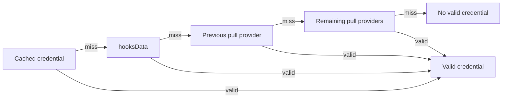

# Access control

[`BaseAccessControls`](../../src/access/BaseAccessControls.sol) provides the
credential system used by `OpenTermHooks`, `FixedTermHooks`, and
`PeriodicTermHooks`.

One hooks instance can serve several markets. State belongs at two levels:

- provider configuration and lender credentials belong to the hooks instance;
- action requirements and known-lender status belong to each market.

See [Hooks](./hooks.md) for callbacks and
[Role providers](./role-providers.md) for provider contracts.

## Authority

- The hooks administrator manages the instance name, provider attachments,
  provider TTLs, deposit blocks, and template-specific market settings.
- Each role provider owns or validates credentials under its own rules.
  Attaching one does not transfer its administration to the hook.
- The market borrower operates that market. A borrower transfer does not change
  the hooks administrator or provider configuration.
- The creating hooks factory deploys and indexes instances. It cannot initiate
  an administrator transfer or reassign an instance.

Hook administration is not credential authority. The administrator does not
become a provider automatically.

## Hook administration

The current administrator can:

- request a transfer with `requestAdministratorTransfer`;
- replace the pending request; or
- cancel it with `cancelAdministratorTransfer`.

The target must be nonzero, differ from the current administrator, and be
registered in the ArchController when requested.

The pending administrator has no authority until it calls
`acceptAdministratorTransfer`. Acceptance checks registration again, stores the
new administrator, clears the pending address, and calls the creating factory's
`onHooksAdministratorTransferred` in the same transaction. If that callback
fails, the transfer reverts.

The transfer changes who can configure the hooks instance. It does not:

- transfer markets;
- change lender status;
- change provider membership or administration; or
- follow a later market-borrower transfer.

The compatibility getter `borrower()` returns the current hooks administrator.

## Provider configuration

The administrator can:

- attach a provider with `addRoleProvider`;
- remove one with `removeRoleProvider`; or
- deploy and attach one through a compatible factory with
  `createRoleProvider`.

On first attachment, the hook probes `isPullProvider()` with `staticcall`. Only
a successful full-word response equal to `true` creates a pull provider. A
revert, short response, `false`, or malformed boolean creates a non-pull
provider. Later updates can change the TTL, but do not classify the provider
again.

Pull providers participate in automatic `getCredential` checks. Non-pull
providers do not. Any approved provider can:

- push credentials through `grantRole` or `grantRoles`; and
- be selected for an explicit `validateCredential` call through `hooksData`.

Removal uses swap-and-pop, so provider order and indices are unstable. Removing
a provider does not rewrite lender records immediately. Its cached credentials
become unsupported on the next validation.

## Credential state and expiry

Each hooks instance stores one `LenderStatus` per lender:

```solidity
struct LenderStatus {
  bool isBlockedFromDeposits;
  address lastProvider;
  bool canRefresh;
  uint32 lastApprovalTimestamp;
}
```

Only the latest credential is retained. Its expiry uses the provider's current
TTL:

```text
expiry = min(lastApprovalTimestamp + timeToLive, type(uint32).max)
valid  = lastApprovalTimestamp != 0 && expiry >= block.timestamp
```

- Changing a TTL immediately changes the effective expiry of every credential
  that provider issued.
- A zero-TTL pull credential is never accepted from cache. The provider is
  called on every gated interaction, including another interaction at the same
  timestamp.
- A pushed credential with zero TTL only works at its grant timestamp. It does
  not refresh automatically, but explicit validation can replace it.
- Positive TTLs include the exact expiry timestamp. Expiry arithmetic saturates
  at `type(uint32).max`.

That cap is the V2.x absolute timestamp horizon. It does not represent
indefinite access after 2106-02-07 06:28:15 UTC; see
[known limitations](../security/known-issues.md#timestamp-horizon).

### Grants, revocation, and deposit blocks

An approved provider can grant a credential with a nonzero timestamp no later
than `block.timestamp`. The result must still be valid.

A new grant can replace the current credential only if:

- the caller is the recorded provider;
- the recorded provider is no longer approved; or
- the new expiry is strictly later.

Only `lastProvider` can revoke the credential through `revokeRole` or
`revokeRoles`. That remains true after the provider is removed from the hook.

`blockFromDeposits` clears the credential and sets the local deposit block.
`unblockFromDeposits` clears the block without restoring the credential. A later
refresh keeps the block flag.

## Validation order

State-changing checks look for a credential in this order:

1. Use a supported, unexpired cached credential, except for a zero-TTL pull
   credential.
2. Process `hooksData`, if present.
3. Refresh the previous credential through its pull provider, if that provider
   remains supported and refreshable.
4. Query the other pull providers, skipping providers already tried.
5. Store the new credential, or clear the stale one if every attempt misses.
   The market action decides whether a missing credential should revert.



### `hooksData`

```solidity
abi.encodePacked(provider)                 // exactly 20 bytes
abi.encodePacked(provider, validationData) // more than 20 bytes
```

- Exactly 20 bytes selects an approved pull provider for `getCredential`.
- More than 20 bytes selects any approved provider for `validateCredential`.
  The remaining bytes become validation data.
- Fewer than 20 bytes are ignored.
- A selected pull provider is not tried again during the same validation.

`getCredential` uses `staticcall`. A revert, short response, zero timestamp,
future timestamp, or expired result is a miss. Validation then continues.

`validateCredential` may change state. A revert or invalid timestamp is also a
miss. A successful call returning fewer than 32 bytes reverts with
`InvalidCredentialReturned`; provider side effects cannot survive without a
usable result. Returned words are read as `uint32` timestamps.

## Market policy

[Fixed-term](./fixed-term-hooks.md) and
[periodic-term](./periodic-term-hooks.md) rules apply on top of this shared
policy.

### Deposits

`onDeposit` rejects locally blocked accounts and enforces the minimum deposit.
It then tries to validate a credential.

- If the market requires deposit access, an invalid lender is rejected.
- If access is optional, a valid lender is still recorded as known for that
  market.

### Transfers

`onTransfer`:

1. rejects every transfer if transfers are disabled;
2. accepts a known recipient without another access check;
3. accepts the market's nonzero `registeredWrapper()` without another access
   check;
4. rejects any other unknown recipient with a local deposit block; and
5. otherwise tries validation, requiring a credential only when transfer policy
   says so.

A valid recipient becomes known for that market.

The registered-wrapper exception is recipient-only. It permits market-token
transfers into the canonical wrapper but does not exempt transfers out of it.
On `withdraw` or `redeem`, the receiver follows ordinary recipient policy: a
known lender remains eligible after a deposit block, while an unknown blocked
or otherwise unauthorized receiver is rejected. Sanctions checks remain
independent and apply to both the wrapper and receiver.

### Queueing withdrawals

If withdrawal access is enabled, a known lender can queue without a current
credential. An unknown lender must validate. Fixed maturity and periodic
withdrawal windows still apply.

A market can require withdrawal access only when deposits also require access
and transfers either require access or are disabled. Tokens cannot be sent to
an account that would then be unable to queue them.

### Executing withdrawals

`onExecuteWithdrawal` performs no access check. Credential expiry, revocation,
provider removal, and deposit blocks cannot stop execution of an already queued
withdrawal.

## Known lenders

Known-lender status is permanent and scoped to one market. An account becomes
known after depositing or receiving market tokens with a valid credential.
There is no method to clear it.

Expiry, revocation, provider removal, and deposit blocks do not remove known
status. A known account can still receive transfers and queue withdrawals
without revalidation, subject to the market's other rules. A deposit block still
stops new deposits.

## Read-only interface

- `getPreviousLenderStatus(account)` returns stored status without refreshing.
- `getLenderStatus(account)` checks the cache and pull providers in memory. It
  cannot consume validation data or persist a refresh.
- `getRoleProvider`, `getPullProviders`, and `getPushProviders` return current
  provider configuration. Array order is unstable.
- `isMarketTransferRecipientAllowed(market, recipient)` rejects disabled
  transfers. When transfers are enabled, it accepts the market's nonzero
  `registeredWrapper()`. Other recipients follow the ordinary policy: unknown
  blocked recipients are rejected, while unrestricted transfers, known lenders,
  or recipients with a current credential are accepted.

## Tests

- [`BaseAccessControls.t.sol`](../../test/access/BaseAccessControls.t.sol):
  provider management, credential lifecycle, TTLs, validation order, and
  administrator transfer
- [`OpenTermHooks.t.sol`](../../test/access/OpenTermHooks.t.sol): open-term policy
- [`FixedTermHooks.t.sol`](../../test/access/FixedTermHooks.t.sol): access plus
  fixed-term restrictions
- [`PeriodicTermHooks.t.sol`](../../test/access/PeriodicTermHooks.t.sol): access
  plus periodic withdrawal windows
